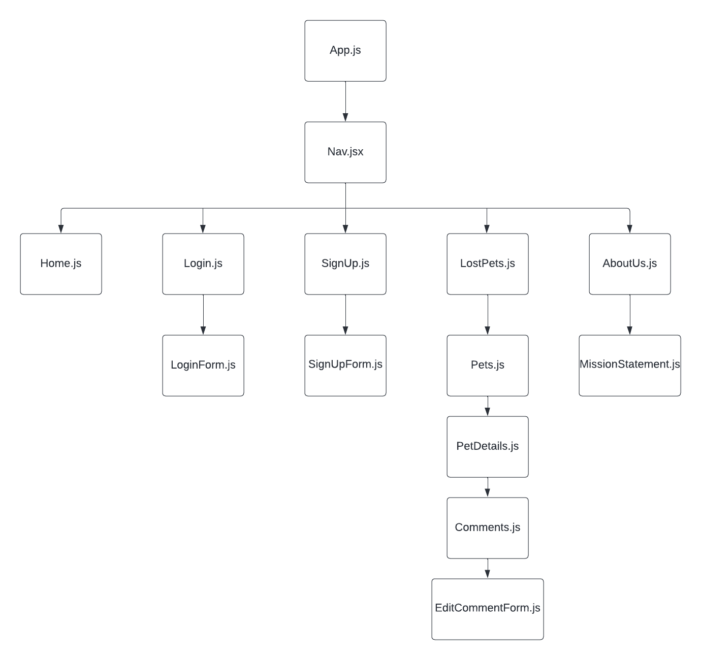

# Find-A-Pet_Frontend

## Date: 12/07/2022

### Ryan Caillet

#### [LinkedIn](https://www.linkedin.com/in/ryan-caillet/) | [GitHub](https://github.com/rycaillet)

---

####

**Website Link:**
[Heroku](/)

---

## **_Description_**

#### Do you have a lost pet? Or simply want to be a contributing member of society who also happens to love reuiniting lost fur babies to their owners? Well the objective of this app is to show lost pets while giving a description of that pet and allowing you to add your own comments to tell the user if you know its whereabouts or have seen the pet recently.

---

#### Link to Trello Board: [Trello](https://trello.com/b/wI9UlSCe/capstone-project)

### CHD

---

### **_Technologies_**

- Front-End

  - React.js
  - CSS

- Back-End

  - node.js
  - express
  - Sequilize
  - PostgreSQL

---

### **_Getting Started_**

#### - Fork and Clone
run: 
1. `npm i`
2. `npm run start`

---

### **_Screenshots_**

> #### **Home Page**

> #### **Lost Pets Page**

> #### **Comments Page**

### **_Task Lists_**

- [ ] Add more pages so it can look like a proper website
- [ ] Make a Landing page
- [ ] Add user authentication
- [ ] create a back-end

---

### **_Credits_**

---
